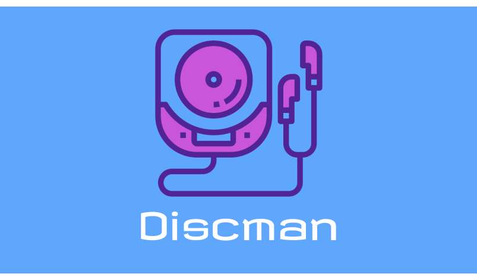
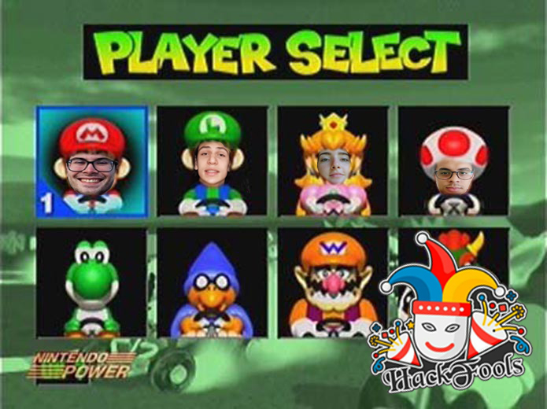

# Discman

**As músicas da melhor época, agora no seu Discord. E nem ouse tocar músicas mais recentes, senão...**

## Sobre
Esse bot foi desenvolvido para o Hackfools 2021 com tema "Resolvendo problemas atuais com tecnologia dos anos 90".

Dado esse contexto, não pensamos em problemática maior atualmente do que o fim do Groovy, um bot de música do Discord. No entanto, o nosso bot consegue ser ainda melhor com uma vasta seleção das músicas dos anos 90.

Uma não tão grata surpresa acontece ao tentar ouvir músicas de diferentes épocas...

O pitch do nosso projeto pode ser encontrado aqui:

## Desenvolvimento
O nosso projeto foi desenvolvido utilizando Java a partir das bibliotecas [Discord4J](https://github.com/Discord4J/Discord4J) e [LavaPlayer](https://github.com/sedmelluq/lavaplayer).
